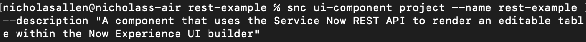
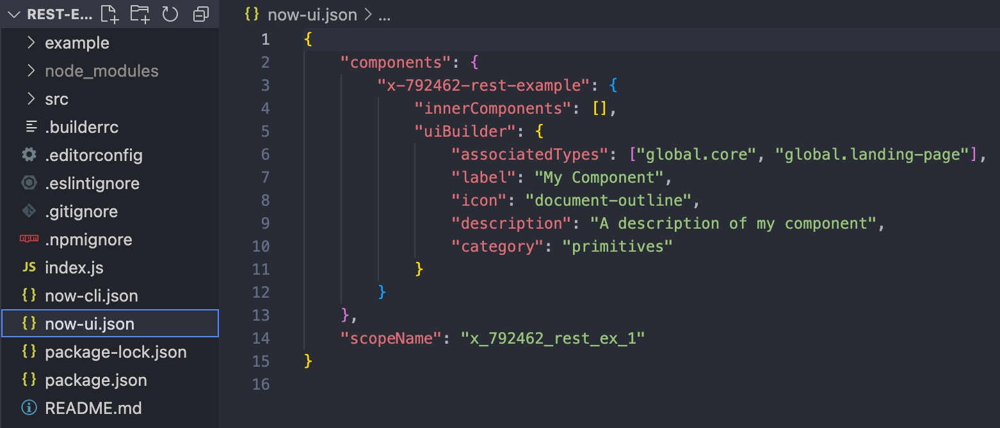
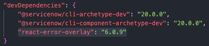
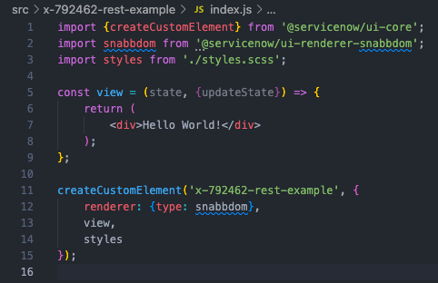

# Building a Custom Table Component for Use in the Now Experience UI Builder

While the Now Experience UI Builder provides a number of built-in components for constructing experiences, sometimes you may want to tweak an existing component beyond what's possible in the UI Builder, or even create your own component from scratch. In this article, we'll walk through the process of creating a custom component, setting up action handlers to call the Service Now REST API, and configuring the component to accept custom parameters passed to it through the UI Builder interface.

This article assumes you have node, the ServiceNow CLI, and the ui-component CLI extension already installed. If not, check out [this article on setting up the development environment on MacOS](https://creator-dna.com/blog/macos-setup), or [this article for getting started on Windows](https://creator-dna.com/blog/1hj866nlrwslzlesekt0c14grhh8u1).

## Project Initialization and First Look

Once our CLI tools are installed and our dev environment is ready, we can create and navigate to our new project folder by opening a terminal and running:

`mkdir my-project-name && cd my-project-name`

Then, we initialize our project by running the project command along with the `--name` and `--description` flags. You can also provide a scope with the optional `--scope` flag. 

`snc ui-component project --name my-project-name --description "Our Project Description"`

> Note: If you don't have internet or access to your instance, you'll have to use the `--offline` flag as well as providing a custom scope with the `--scope` flag.

The ui-component CLI will then create the boilerplate files for the project. If it prompts you to update yo, do so with `npm install -g yo`.

Now that the project's been scaffolded, we're almost ready to take a look at our new component. Run `npm install` to install the project dependencies (this may take a few minutes).

While the dependencies are installing, let's take a look at the files that have been added to the project folder:

The `now-ui.json` is where we configure the details of our new component, including how this component appears and interacts with the UI Builder interface. We'll add more to it later, but for now, the appearance of the component in the UI Builder menus (label, icon, description) can be set in this file.

The `now-cli.json` contains the config for the CLI. If you have issues proxying your requests from the development environment, this is where to look.

The only top-level file we'll need to edit is the `package.json`. As of time of writing, there's an additional dependency we'll need to install to test our components in the local environment. Adding the line `"react-error-overlay": "6.0.9"` to `devDependencies` (and running the command `npm install`) will prevent a bugged error overlay from blocking interaction with our component in the development environment.

`snc ui-component develop` to start the development server. If the process seems to be stuck, ctrl + c and run the same command again. You should get a message confirming that the project is now running at http://localhost:8081/. Navigate to this address and you'll see...

We're looking at our brand new component! There's just nothing in it yet.

If we open the src/ directory, we'll see the files that we'll be editing to create our custom components. The convention used by ServiceNow for organizing component files is to store each component/subcomponent in its own folder, with an index.js as the entrypoint. When we start, we can write code directly in the index.js, but as a component grows more complex, you may want to refactor it into a view.js, actionHandlers.js, etc.

> Note: The compiler that ServiceNow uses to create these components does not recognize .jsx files - use .js instead.

Opening the src/index.js file, we discover the reason for the blank white screen: our component is rendering only an empty div. Type "Hello World!" into the div, and the component will automatically recompile and display in the browser.

At this point, the index.js file contains all the code for our component (aside from any styling rules we may have included in the styles.scss):

The createCustomElement function accepts the name of the component as the first argument, and an object containing the rendering options as the second component. When the project is initialized, it contains three properties:

- **renderer**: The render engine to use. ServiceNow recommends not changing this property.
- **view**: The jsx to render. Usually, as in this project, this property references a function that returns jsx.
- **styles**: A stylesheet for the element. In this case, it's the imported styles.scss file.

There are more configuration options, like **state**, **properties**, and **actionHandlers**, which we'll use later on. 

> What's JSX? If you're not familiar with frameworks that use webcomponents (like React), the arrow function on line 5 might look strange to you. JSX is just html that's mixed in with javascript. The view function above is simple - it just spits out whatever html elements we write in the return statement. However, since it's a function, this **component** can be as dynamic as we want it to be - we can change what's returned based on the arguments passed in, and/or further transform or manipulate data in the function body, or even reference other or pass in other components - this is called *composition*.

> There are some quirks to jsx - to avoid reserved javascript words, the html 'class' attribute becomes 'className', and the 'for' attribute becomes 'htmlFor.' Using curly braces {} within jsx marks code that will be evaluated, and is useful for variable interpolation or short-circuiting. Finally, remember that although we can write jsx within our .js files, this particular compiler doesn't recognize the .jsx extension.

* Initialize state
* Update State
* Include HTTP effect action Handler
* Render Result
* Make Table subcomponent
    * & Row component
* Replace in-app state tracking with UI Builder property
