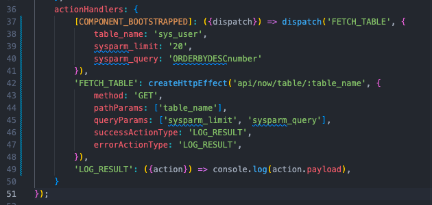

## Action Handlers and Effects

Now that we're familiar with how to initialize state and update data stored in state, it's nearly time to consume the REST API to retrieve and display some data from our instance.

To do this, we'll set up some action handlers. REST API calls don't necessarily have to be triggered by actions, but doing so makes it easy organize our code in a consistent and reusable way (once you get the hang of the structure, that is).

For our table component, we'll want to retrieve data immediately when it appears, so we'll utilize a built-in action, COMPONENT_BOOTSTRAPPED. We'll import it with `import { actionTypes } from '@servicenow/ui-core';`, and `const {COMPONENT_BOOTSTRAPPED} = actionTypes;`. Then, we'll add a new property `actionHandlers` to the config object we're passing into the createCustomElement() function, and map COMPONENT_BOOTSTRAPPED to a method:

```
actionHandlers: {
    [COMPONENT_BOOTSTRAPPED]: () => console.log('bootstrapped!')
}
```

> A Note on 'Actions': Actions in ServiceNow are similar to Actions in a framework like Redux. They're composed of two pieces: a type (string), and a payload. Actions can be dispatched manually, or by built-in triggers in the component life cycle. In a Now Experience component, if an action.type matches a key defined in the actionHandlers object, the function mapped to that key (the effect) will fire.

If you refresh the page and check the console, you'll see that the function we mapped to the COMPONENT_BOOTSTRAPPED action runs once, but doesn't run again if we edit the text input and force the component to rerender. This makes the COMPONENT_BOOTSTRAPPED action perfect for doing the initial fetch for the data we want to present to the user, and saving that data in the component state.

We'll use the createHttpEffect helper function provided by ServiceNow to build our effect - while a regular REST request (using 'fetch' or 'axios,' for example) will work, using createHttpEffect allows us to tap into the coeffects provided by the createCustomElement function and follow the same action patterns elsewhere in our component. 

To test our REST request, we'll need to configure three total actions - one to send an action with a payload containing the request options, one create the effect and initiate the request, and dispatch an action with the results, and a final action to handle the response.

First, let's create a new action 'FETCH_TABLE', which will accept an action and send the request. Here, we establish the request method, and define the parameters (according to the [ServiceNow REST API documentation](https://developer.servicenow.com/dev.do#!/reference/api/sandiego/rest/)) that we'll send in the initial action. We'll also define the type of the action that will be dispatched when the request succeeds or fails.

The createHttpEffect function takes two arguments: the API endpoint, and an object containing the method, query parameters, and other options. Once the createHttpEffect is bound to an action type, we can create a REST call just by dispatching an action and attaching the relevant parameters.

```
'FETCH_TABLE': createHttpEffect('api/now/table/:table_name', {
    method: 'GET',
    pathParams: ['table_name'],
    queryParams: ['sysparm_limit', 'sysparm_query'],
    successActionType: 'LOG_RESULTS',
    errorActionType: 'LOG_RESULTS',
}),
```

When the request resolves, we'll use an additional action handler to log the results:

```
'LOG_RESULTS': ({action}) => console.log(action.payload)
```

This handler uses object destructuring to access the action that triggers it, and log the payload of that action.

Finally, we'll edit our COMPONENT_BOOTSTRAPPED handler to dispatch an action with the details of the request we want to make when the component loads. For now, we'll just query the sys_user table for 20 users, ordered by the 'number' field:

```
[COMPONENT_BOOTSTRAPPED]: ({dispatch}) => dispatch('FETCH_TABLE', {
			table_name: 'sys_user',
			sysparm_limit: '20',
			sysparm_query: 'ORDERBYDESCnumber'
		}),
```

> In the above examples, we access **dispatch** and **action** by destructuring the **coeffects**, which are passed to all of our action handlers by default. There are a number of useful objects and functions that we can access in this way - these are detailed in the Effects section of the [Action Handler Documentation](https://developer.servicenow.com/dev.do#!/reference/now-experience/quebec/ui-framework/main-concepts/action-handlers)

AT this point, our actionHandlers object should look like this: 



Now that our handlers have been defined, when we refresh the page, the following processes will occur:

1. The COMPONENT_BOOTSTRAPPED lifecycle action will trigger our handler to dispatch a 'FETCH_TABLE' action with the given configuration.
2. The 'FETCH_TABLE' handler will catch that action, and create an HTTP effect, sending a GET request to the api/now/table/{table_name} endpoint of our ServiceNow instance, and dispatching a 'LOG_RESULT' action when the request resolves
3. The 'LOG RESULT' handler prints the action payload, containing our request results, to the console.

Logging the results is great and all, but to actually use the data, we'll want to store it in the component state. This way, when the request resolves, and state is updated, our component will automatically rerender itself with the retrieved data. To do this, we'll need to update our `initialState` property with a property that we'll store our query results in:

```
initialState: {
    ...,
    query_result: [],
}
```

and change our 'FETCH_TABLE' action handler to include `successActionType: 'FETCH_TABLE_SUCCESS'`, defining the 'FETCH_TABLE_SUCCESS' handler like so: 

```
'FETCH_TABLE_SUCCESS': ({action, updateState}) => {
    updateState({query_result: action.payload.result})
},
```

## Rendering the Request Result

Now that we're successfully retrieving data from our ServiceNow instance, we'll want to display that data in our component. For now, we'll make a simple functional component that will accept the dataset as props, and output an html table with the first name, last name, and email address of the user.

Since our file is getting larger, creating our table subcomponent in another file will help keep our code organized. 

In the component folder, create a new file named `ResultTable.js`, with the following component boilerplate:

```
const ResultTable = ({data}) => {
  return (
    <div>ResultTable</div>
  )
}

export default ResultTable
```

Our subcomponent can now be included in our `index.js` with 

`import ResultTable from './ResultTable';`

and rendered within our view component by adding `<ResultTable />` to the jsx in the return statement. At the moment, it will just display the text 'ResultTable', but we can provide the `query_result` that we're storing in state by including it in the component props, like so:

`<ResultTable data={state.query_result} />`

If we want to test that our data is being passed appropriately, we can `console.log(data)` within the ResultTable component, or even change the ResultTable return statement to show the component updating on the DOM in realtime: 

`<div>{JSON.stringify(data)}</div>`

Now, we just have to add the necessary logic to the ResultTable component to map the results to an html table. The ES6 Array.map() method is particularly helpful for this.

```
const ResultTable = ({data}) => {
  return (
    <table>
      <thead>
        <th>First Name</th>
        <th>Last Name</th>
        <th>Email</th>
      </thead>
      <tbody>
        {data.map(row => {
          return <tr>
            <td>{row.first_name}</td>
            <td>{row.last_name}</td>
            <td>{row.email}</td>
          </tr>
        })}
      </tbody>
    </table>
  )
}

export default ResultTable
```

gives us: 


## User Interaction

By using our existing tools to update state and dispatch actions, we can 

==================================

Still TODO:
- [x] Overview of template files
- [x] Update State
- [x] Include HTTP effect action Handler
- [x] Render Request Result
- [x] Make Table subcomponent
- [ ] Replace in-app state tracking with UI Builder property
- [ ] Style the Table
- [ ] Deploy
- [ ] Warnings: Loops


* Confirm - can you use actions to pass messages between different components? A: Kind of: Actions are unidirectional and not observable by siblings/children. Store management must be handled at the top level (user params, I think?)

-- [Another simple httpeffect article](https://developer.servicenow.com/blog.do?p=/post/nowexp-http-effect/)]


The queries accept the field name, not the key value returned.