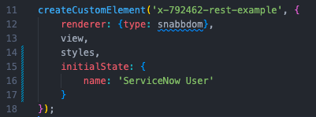
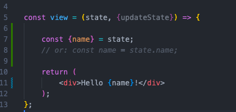
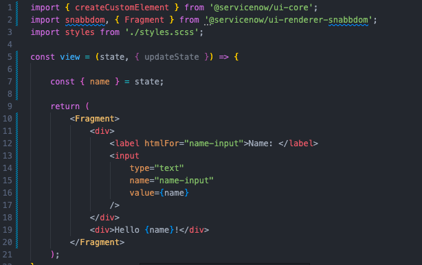
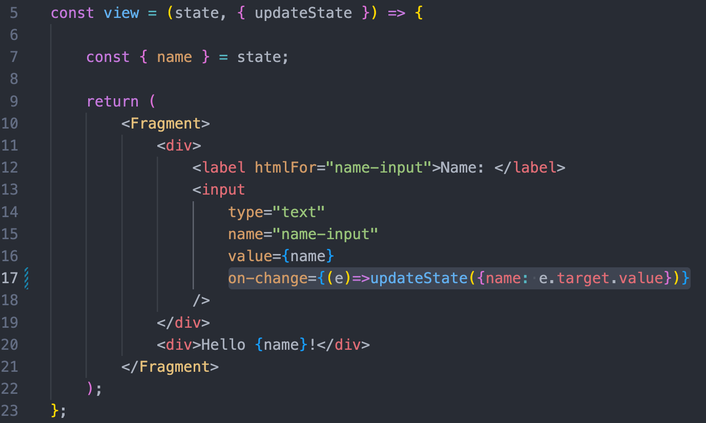

# Building a Custom Table Component for Use in the Now Experience UI Builder

While the Now Experience UI Builder provides a number of built-in components for constructing experiences, you may want to tweak an existing component beyond what's possible in the UI Builder, or even create your own component from scratch. In this series of articles, we'll walk through the process of creating a custom component, setting up action handlers to call the Service Now REST API, and configuring the component to accept custom parameters passed to it through the UI Builder interface.

This article assumes you have node, the ServiceNow CLI, and the ui-component CLI extension already installed. If not, check out [this article on setting up the development environment on MacOS](https://creator-dna.com/blog/macos-setup), or [this article for getting started on Windows](https://creator-dna.com/blog/1hj866nlrwslzlesekt0c14grhh8u1).

## Project Initialization and First Look

Once our CLI tools are installed and our dev environment is ready, we can create and navigate to our new project folder by opening a terminal and running:

`mkdir my-project-name && cd my-project-name`

Then, we initialize our project by running the project command along with the `--name` and `--description` flags. You can also provide a scope with the optional `--scope` flag. 

`snc ui-component project --name my-project-name --description "Our Project Description"`


> Note: If you don't have internet or access to your instance, you'll have to use the `--offline` flag as well as providing a custom scope with the `--scope` flag.

The ui-component CLI will then create the boilerplate files for the project. If it prompts you to update yo, do so with `npm install -g yo`.

Now that the project's been scaffolded, we're almost ready to take a look at our new component. Run `npm install` to install the project dependencies (this may take a few minutes).

While the dependencies are installing, let's take a look at the files that have been added to the project folder:

The `now-ui.json` is where we configure the details of our new component, including how this component appears and interacts with the UI Builder interface. We'll add more to it later, but for now, the appearance of the component in the UI Builder menus (label, icon, description) can be set in this file.


The `now-cli.json` contains the config for the CLI. If you have issues proxying your requests from the development environment, this is where to look.

The only top-level file we'll need to edit is the `package.json`. As of time of writing, there's an additional dependency we'll need to install to test our components in the local environment. Adding the line `"react-error-overlay": "6.0.9"` to `devDependencies` (and running the command `npm install`) will prevent a bugged error overlay from blocking interaction with our component in the development environment.


`snc ui-component develop` to start the development server. If the process seems to be stuck, ctrl + c and run the same command again. You should get a message confirming that the project is now running at http://localhost:8081/. Navigate to this address and you'll see...


We're looking at our brand new component! There's just nothing in it yet.

If we open the src/ directory, we'll see the files that we'll be editing to create our custom components. The convention used by ServiceNow for organizing component files is to store each component/subcomponent in its own folder, with an index.js as the entrypoint. When we start, we can write code directly in the index.js, but as a component grows more complex, you may want to refactor it into a view.js, actionHandlers.js, etc.

> Note: The compiler that ServiceNow uses to build these components does not recognize .jsx files - use .js instead.

Opening the src/index.js file, we discover the reason for the blank white screen: our component is rendering only an empty div. Type "Hello World!" into the div, and the component will automatically recompile and display in the browser.

At this point, the index.js file contains all the code for our component (aside from any styling rules we may have included in the styles.scss):


The createCustomElement function accepts the name of the component as the first argument, and an object containing the rendering options as the second component. When the project is initialized, it contains three properties:

- **renderer**: The render engine to use. ServiceNow recommends not changing this property.
- **view**: The jsx to render. Usually, as in this project, this property references a function that returns jsx.
- **styles**: A stylesheet for the element. In this case, it's the imported styles.scss file.

There are more configuration options, like **state**, **properties**, and **actionHandlers**, which we'll use later on. 

> What's JSX? If you're not familiar with frameworks that use webcomponents (like React), the arrow function on line 5 might look strange to you. JSX is just html that's mixed in with javascript. The view function above is simple - it just spits out whatever html elements we write in the return statement. However, since it's a function, this **component** can be as dynamic as we want it to be - we can change what's returned based on the arguments passed in, and/or further transform or manipulate data in the function body, or even reference other or pass in other components - this is called *composition*.

> There are some quirks to jsx - to avoid reserved javascript words, the html 'class' attribute becomes 'className', and the 'for' attribute becomes 'htmlFor.' Using curly braces {} within jsx marks code that will be evaluated, and is useful for variable interpolation or short-circuiting. Finally, remember that although we can write jsx within our .js files, this particular compiler doesn't recognize the .jsx extension.

## Stateful Components

By adding html (jsx) to the return statement of the view function, we can add content to our component, and style it with the styles.scss page. However, to add interactivity and leverage the performance that comes from using the VirtualDOM, we'll manipulate the state of the component to determine what's rendered.

In the createCustomElement function, we'll add a property to the options object called 'initialState,' and map it to an object with a 'name' key and a corresponding value.



 initialState sets the default state when the component is mounted. The state can then be accessed from the view component, or any actionHandlers we may add later on.

 To access the current value of 'name', we can use object destructuring or dot notation to store the value in a variable, then use curly braces to evaluate that variable as code in our jsx.



Returning to the browser, you should see that the component has updated to display the name that we passed in. The neat thing about storing our dynamic values in state is that, when the state of our component changes, only this single component will rerender, without requiring a refresh or rerendering the rest of the components on the page. This makes our app feel snappy and performant, and helps us organize our project by providing components only the data that is relevant to its function.

We can see this in action by adding a controlled input, which will allow our user to interact with the state and see the changes in real time. Let's add a div with a label and text input above our existing div. In addition to the type and name attributes, we'll also set `value={name}`. This will cause an error, since the return jsx of a component must be a single element - so we'll `import { Fragment } from '@servicenow/ui-renderer-snabbdom'` to wrap around our divs. 



Once our input element is added and rendering on the page, we can make the input controlled by adding the following on-change attribute and function:

`on-change={(e) => updateState({name: e.target.value})}`

This attribute adds an event listener to the input, which will call the updateState function with the event as an argument when the input value is changed. UpdateState takes a single argument, an object with key/value pairs for the aspects of state that we want to change.



> Note: If you're used to React, you might expect to have to spread state when passing it to the updateState() function, in order to avoid losing any other properties of the state object. Here, though, the updateState() function will only change the values of the properties you provide it, so spreading state is not necessary.

Unlike the `onChange` property of React, our `on-change` function will fire only when we press enter or the input loses focus. If you'd like your component to update on every keystroke, use `on-keyup`.

## Action Handlers and Effects

Now that we're familiar with how to initialize state and update data stored in state, it's nearly time to consume the REST API to retrieve and display some data from our instance.

To do this, we'll set up some action handlers. REST API calls don't necessarily have to be triggered by actions, but doing so makes it easy organize our code in a consistent and reusable way (once you get the hang of the structure, that is).

For our table component, we'll want to retrieve data immediately when it appears, so we'll utilize a built-in action, COMPONENT_BOOTSTRAPPED. We'll import it with `import { actionTypes } from '@servicenow/ui-core';`, and `const {COMPONENT_BOOTSTRAPPED} = actionTypes;`. Then, we'll add a new property `actionHandlers` to the config object we're passing into the createCustomElement() function, and map COMPONENT_BOOTSTRAPPED to a method:

```
actionHandlers: {
    [COMPONENT_BOOTSTRAPPED]: () => console.log('bootstrapped!')
}
```

> A Note on 'Actions': Actions in ServiceNow are similar to Actions in a framework like Redux. They're composed of two pieces: a type (string), and a payload. Actions can be dispatched manually, or by built-in triggers in the component life cycle. In a Now Experience component, if an action.type matches a key defined in the actionHandlers object, the function mapped to that key (the effect) will fire.

If you refresh the page and check the console, you'll see that the function we mapped to the COMPONENT_BOOTSTRAPPED action runs once, but doesn't run again if we edit the text input and force the component to rerender. This makes the COMPONENT_BOOTSTRAPPED action perfect for doing the initial fetch for the data we want to present to the user, and saving that data in the component state.

We'll use the createHttpEffect helper function provided by ServiceNow to build our effect - while a regular REST request (using 'fetch' or 'axios,' for example) will work, using createHttpEffect allows us to tap into the coeffects provided by the createCustomElement function and follow the same action patterns elsewhere in our component. 

To test our REST request, we'll need to configure three total actions - one to send an action with a payload containing the request options, one create the effect and initiate the request, and dispatch an action with the results, and a final action to handle the response.

First, let's create a new action 'FETCH_TABLE', which will accept an action and send the request. Here, we establish the request method, and define the parameters (according to the [ServiceNow REST API documentation](https://developer.servicenow.com/dev.do#!/reference/api/sandiego/rest/)) that we'll send in the initial action. We'll also define the type of the action that will be dispatched when the request succeeds or fails.

The createHttpEffect function takes two arguments: the API endpoint, and an object containing the method, query parameters, and other options. Once the createHttpEffect is bound to an action type, we can create a REST call just by dispatching an action and attaching the relevant parameters.

```
'FETCH_TABLE': createHttpEffect('api/now/table/:table_name', {
    method: 'GET',
    pathParams: ['table_name'],
    queryParams: ['sysparm_limit', 'sysparm_query'],
    successActionType: 'LOG_RESULTS',
    errorActionType: 'LOG_RESULTS',
}),
```

When the request resolves, we'll use an additional action handler to log the results:

```
'LOG_RESULTS': ({action}) => console.log(action.payload)
```

This handler uses object destructuring to access the action that triggers it, and log the payload of that action.

Finally, we'll edit our COMPONENT_BOOTSTRAPPED handler to dispatch an action with the details of the request we want to make when the component loads. For now, we'll just query the sys_user table for 20 users, ordered by the 'number' field:

```
[COMPONENT_BOOTSTRAPPED]: ({dispatch}) => dispatch('FETCH_TABLE', {
			table_name: 'sys_user',
			sysparm_limit: '20',
			sysparm_query: 'ORDERBYDESCnumber'
		}),
```

> In the above examples, we access **dispatch** and **action** by destructuring the **coeffects**, which are passed to all of our action handlers by default. There are a number of useful objects and functions that we can access in this way - these are detailed in the Effects section of the [Action Handler Documentation](https://developer.servicenow.com/dev.do#!/reference/now-experience/quebec/ui-framework/main-concepts/action-handlers)

AT this point, our actionHandlers object should look like this: 


Now that our handlers have been defined, when we refresh the page, the following processes will occur:

1. The COMPONENT_BOOTSTRAPPED lifecycle action will trigger our handler to dispatch a 'FETCH_TABLE' action with the given configuration.
2. The 'FETCH_TABLE' handler will catch that action, and create an HTTP effect, sending a GET request to the api/now/table/{table_name} endpoint of our ServiceNow instance, and dispatching a 'LOG_RESULT' action when the request resolves
3. The 'LOG RESULT' handler prints the action payload, containing our request results, to the console.

Logging the results is great and all, but to actually use the data, we'll want to store it in the component state. This way, when the request resolves, and state is updated, our component will automatically rerender itself with the retrieved data. To do this, we'll need to update our `initialState` property with a property that we'll store our query results in:

```
initialState: {
    ...,
    query_result: [],
}
```

and change our 'FETCH_TABLE' action handler to include `successActionType: 'FETCH_TABLE_SUCCESS'`, defining the 'FETCH_TABLE_SUCCESS' handler like so: 

```
'FETCH_TABLE_SUCCESS': ({action, updateState}) => {
    updateState({query_result: action.payload.result})
},
```

## Rendering the Request Result

Now that we're successfully retrieving data from our ServiceNow instance, we'll want to display that data in our component. For now, we'll make a simple functional component that will accept the dataset as props, and output an html table with the first name, last name, and email address of the user.

Since our file is getting larger, creating our table subcomponent in another file will help keep our code organized. 

In the component folder, create a new file named `ResultTable.js`, with the following component boilerplate:

```
const ResultTable = ({data}) => {
  return (
    <div>ResultTable</div>
  )
}

export default ResultTable
```

Our subcomponent can now be included in our `index.js` with 

`import ResultTable from './ResultTable';`

and rendered within our view component by adding `<ResultTable />` to the jsx in the return statement. At the moment, it will just display the text 'ResultTable', but we can provide the `query_result` that we're storing in state by including it in the component props, like so:

`<ResultTable data={state.query_result} />`

If we want to test that our data is being passed appropriately, we can `console.log(data)` within the ResultTable component, or even change the ResultTable return statement to show the component updating on the DOM in realtime: 

`<div>{JSON.stringify(data)}</div>`

Now, we just have to add the necessary logic to the ResultTable component to map the results to an html table. The ES6 Array.map() method is particularly helpful for this.

```
const ResultTable = ({data}) => {
  return (
    <table>
      <thead>
        <th>First Name</th>
        <th>Last Name</th>
        <th>Email</th>
      </thead>
      <tbody>
        {data.map(row => {
          return <tr>
            <td>{row.first_name}</td>
            <td>{row.last_name}</td>
            <td>{row.email}</td>
          </tr>
        })}
      </tbody>
    </table>
  )
}

export default ResultTable
```

gives us: 


==================================

Still TODO:
- [x] Overview of template files
- [x] Update State
- [x] Include HTTP effect action Handler
- [ ] Render Request Result
- [ ] Make Table subcomponent
    - [ ] & Row component
- [ ] Replace in-app state tracking with UI Builder property
- [ ] Style the Table


* Confirm - can you use actions to pass messages between different components? A: Kind of: Actions are unidirectional and not observable by siblings/children. Store management must be handled at the top level (user params, I think?)

-- [Another simple httpeffect article](https://developer.servicenow.com/blog.do?p=/post/nowexp-http-effect/)]


The queries accept the field name, not the key value returned.