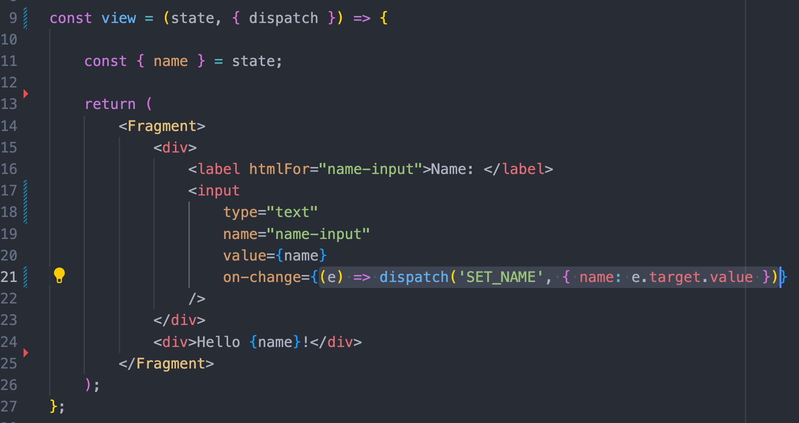
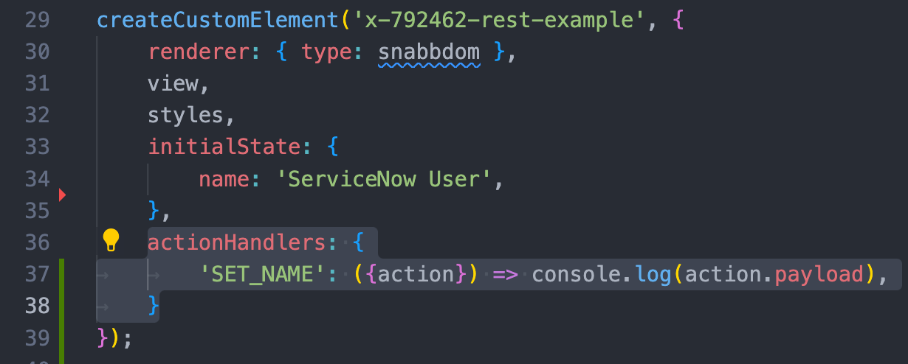

### Custom Components in the Now Experience UI Framework Part 2: Actions and Action Handlers

In the last article, we walked through the process of initializing a custom component with ServiceNow ui-component cli tool, gave a brief overview of the boilerplate files and their function, and built a simple stateful component that tracks user input, and displays the information stored in the component state.

In this article, we'll set up our component to call the ServiceNow REST API with parameters input by the user, store the response in state, and render the result.

## Actions Handlers and Effects

Though you can add a call to the REST API by any of the usual means of doing so, it's best to put our REST call in an Action Handler, along with the rest of our effectful code.

**Actions** in Now Experience operate somewhat similar to the actions you'd find in something Like Redux, with some key distinctions. Actions can be dispatched from our components via user interaction or by hooking into the **lifecycle** of the component. These actions are captured by the **action handlers** that we'll define within the `createCustomElement` function.

Actions and Action Handlers help us to organize our code to reflect the **lifecycle** of the component. Now Experience components rely on unidirectional data flow to update consistently and predictably. In a Now experience component, the flow of data typically looks like this:

```
Component Rendered => Action Triggered => State Updated => Component Rendered
```

So let's write a basic action that we can dispatch via user interaction. We're going to refactor the `on-change` function of our input element to send an action instead of updating state directly. We'll begin by including `{dispatch}` in our view props (it's passed as a prop by `createCustomElement`), and then replacing our on-change function with `(e) => dispatch('SET_NAME', {name: e.target.value})`.



Every time our input's on-change function fires, it will dispatch an action that bubbles up through the DOM. Each action includes a string `type`(good practice is to use SCREAMING_SNAKE case) used to match the action to the appropriate handler, and a payload containing the data we want to pass, usually in the form of an object. Our example action has the type 'SET_NAME', and an object payload with a single key/value pair for now.

We haven't yet set up a handler to catch that action, though - we can test that our action is being dispatched by adding a handler that will print the payload of that action to the console. To do so, we'll create a property `actionHandlers` in the `createCustomElement` config object, which will consist of an object. The keys of our actionHandlers object will correspond to the `type` of the action we want to catch, and the value will consist of a function that we want to run when that action is received. To make sure our action is being dispatched properly, we'll start with a simple `console.log()`.



One thing you may have noticed is that we had to destructure `{action}` to pass it to the arrow function that comprises the action handler. That's because the action handler actually is passed a number of **coeffects**, including **state**, **updateState**, our **action**, and other useful things. This makes it easy to manage state by destructuring `{updateState}` and passing it the `action.payload`.

```
{
SET_NAME: ({action, updateState}) => updateState(action.payload)
}
```

Since we set our payload to be an object with a key/value corresponding to a key/value set with `initialState`, we can pass it directly to `updateState` without needing to massage it. If we return to the browser, we'll see that our simple refactor is complete - changing the content of the input element dispatches an action, which is picked up by our action handler and used to update the state.